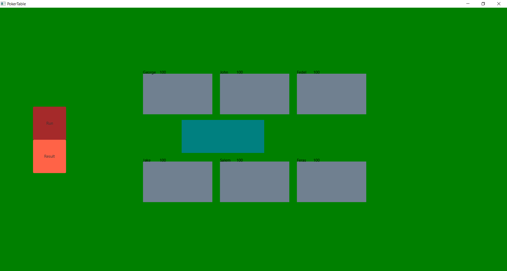
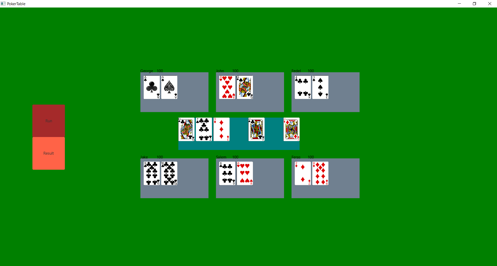
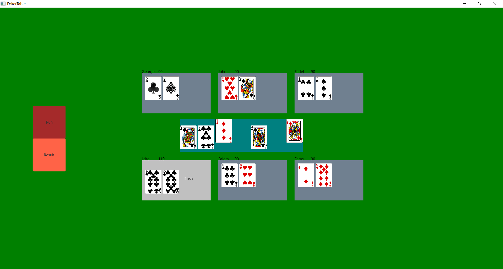

# Poker Game Java
This game was developed using javafx library for its GUI.
The game is highly scalable and perfectly object oriented.
The table class contains Seat class and the Seat class contains the Player class, there are many other classes such as the Game and the Deck classes
The game is still not complete, the game now is running without any user interaction other the the two buttons **Run** and **Result**.
Images of the three states of the game:

